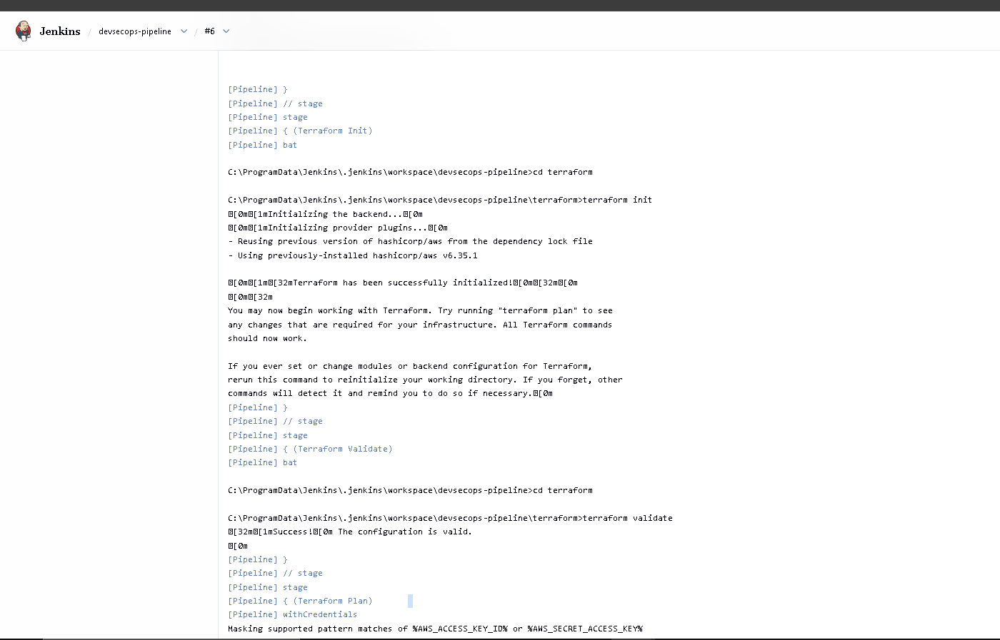
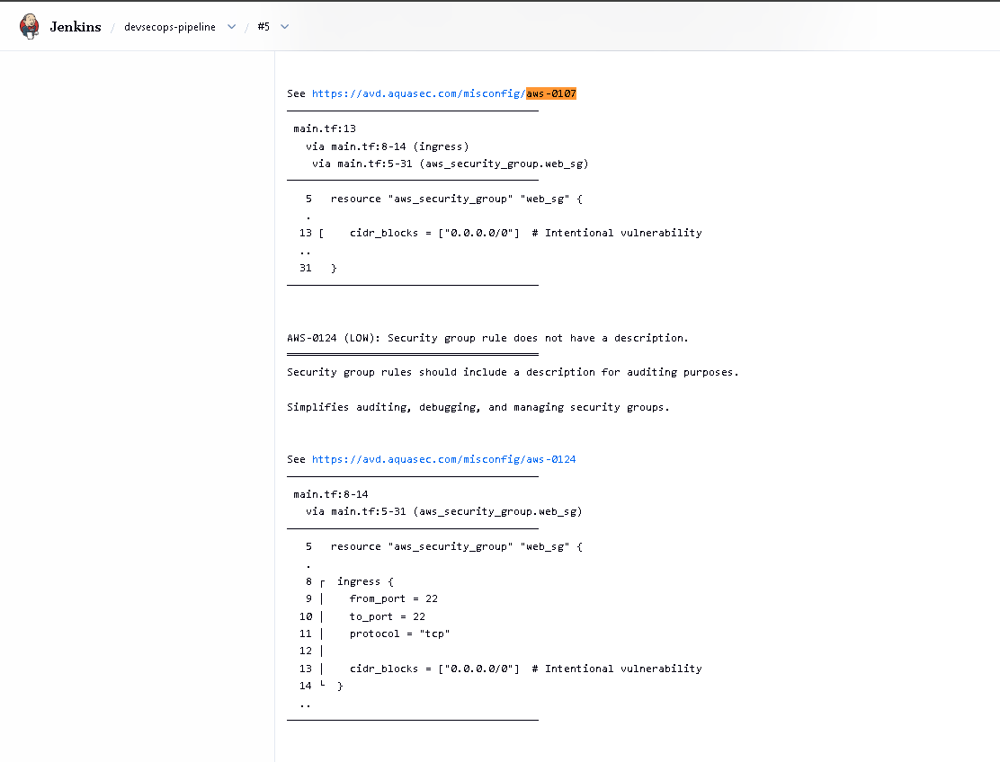
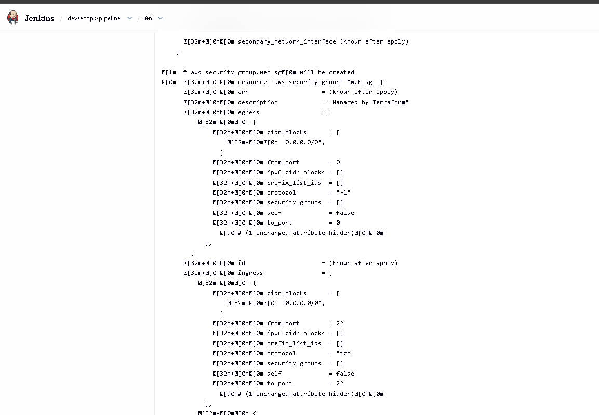
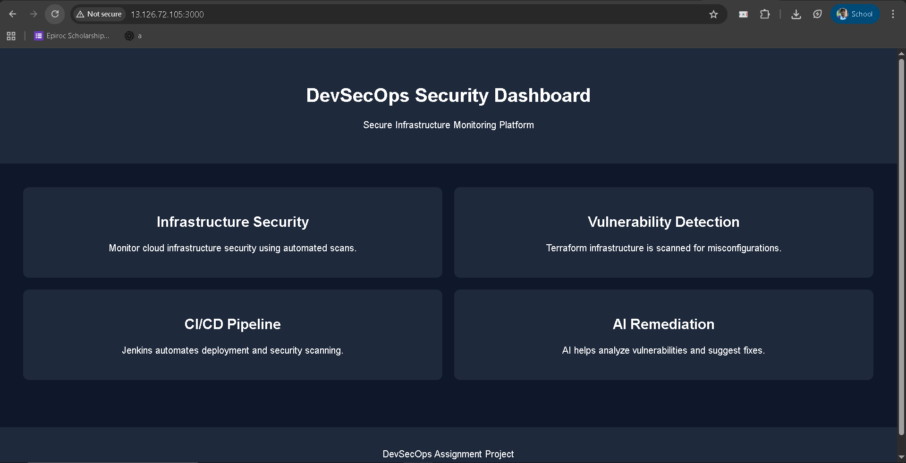
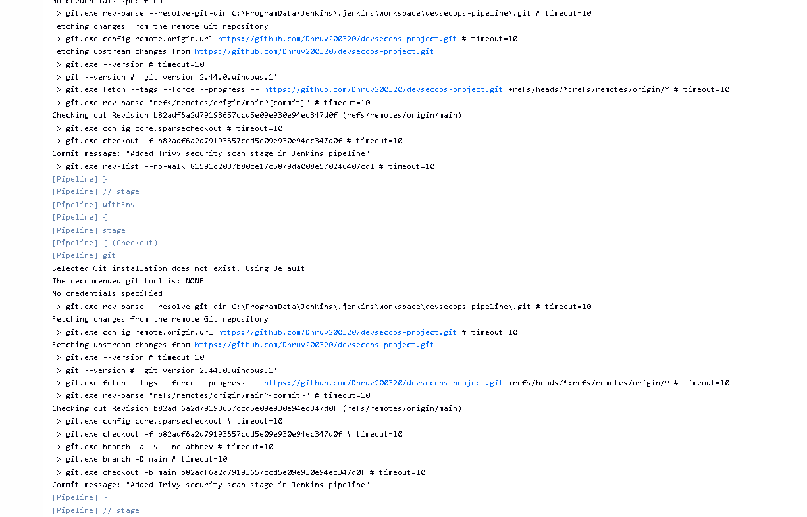

# 🛡️ DevSecOps CI/CD Pipeline with Terraform, Jenkins & Trivy

An automated **DevSecOps pipeline** that integrates infrastructure security scanning, CI/CD automation, and cloud deployment using **Jenkins, Terraform, AWS EC2, and Trivy**.

---

# 📌 Short Description / Purpose

The **DevSecOps Pipeline Project** demonstrates how security can be integrated into a CI/CD workflow.  
The pipeline automatically scans Terraform infrastructure code for vulnerabilities, applies security improvements, and deploys a web application to AWS EC2.

This project helps demonstrate **secure infrastructure deployment, automation, and vulnerability remediation** using modern DevSecOps practices.

---

# 🧰 Tech Stack

⚙️ **Jenkins** – CI/CD pipeline automation  
🌐 **GitHub** – Source code repository  
☁️ **AWS EC2** – Cloud infrastructure hosting the application  
📦 **Terraform** – Infrastructure as Code for cloud provisioning  
🔍 **Trivy** – Security scanner for Terraform configuration  
🟢 **Node.js** – Web application runtime  
📁 **Git** – Version control system  

---

# 📊 Infrastructure Source

Infrastructure configuration is defined using **Terraform scripts**.

Terraform provisions the following resources:

- AWS Security Group
- AWS EC2 Instance
- Network access rules

The web application is deployed on the EC2 instance and accessed through the **public IP address**.

---

# ✨ Features & Highlights

## 🔹 Business Problem

Modern cloud infrastructure is often deployed using Infrastructure as Code (IaC).  
If security vulnerabilities exist in the infrastructure configuration, they can lead to:

- Unauthorized server access
- Data exposure
- Cloud resource misconfiguration
- Infrastructure security risks

Manual security checks are inefficient and often missed during deployment.

---

## 🔹 Goal of the Project

- Integrate **security scanning into the CI/CD pipeline**
- Automatically detect Terraform security vulnerabilities
- Apply AI-assisted remediation fixes
- Deploy secure infrastructure to AWS
- Demonstrate **DevSecOps best practices**

---

## 🔹 CI/CD Pipeline Workflow

Developer pushes code to GitHub  
↓  
Jenkins Pipeline triggers automatically  
↓  
Trivy scans Terraform code for vulnerabilities  
↓  
Terraform validates infrastructure configuration  
↓  
Terraform generates infrastructure plan  
↓  
Infrastructure deployed to AWS EC2  
↓  
Node.js application runs on EC2 public IP

---

# 🔐 Security Improvements Implemented

Several infrastructure security improvements were applied after analyzing the Trivy security scan results.

### SSH Access Restriction

Instead of allowing SSH access from anywhere, access was restricted to a specific IP address.
# 🛡️ DevSecOps CI/CD Pipeline with Terraform, Jenkins & Trivy

An automated **DevSecOps pipeline** that integrates infrastructure security scanning, CI/CD automation, and cloud deployment using **Jenkins, Terraform, AWS EC2, and Trivy**.

---

# 📌 Short Description / Purpose

The **DevSecOps Pipeline Project** demonstrates how security can be integrated into a CI/CD workflow.  
The pipeline automatically scans Terraform infrastructure code for vulnerabilities, applies security improvements, and deploys a web application to AWS EC2.

This project helps demonstrate **secure infrastructure deployment, automation, and vulnerability remediation** using modern DevSecOps practices.

---

# 🧰 Tech Stack

⚙️ **Jenkins** – CI/CD pipeline automation  
🌐 **GitHub** – Source code repository  
☁️ **AWS EC2** – Cloud infrastructure hosting the application  
📦 **Terraform** – Infrastructure as Code for cloud provisioning  
🔍 **Trivy** – Security scanner for Terraform configuration  
🟢 **Node.js** – Web application runtime  
📁 **Git** – Version control system  

---

# 📊 Infrastructure Source

Infrastructure configuration is defined using **Terraform scripts**.

Terraform provisions the following resources:

- AWS Security Group
- AWS EC2 Instance
- Network access rules

The web application is deployed on the EC2 instance and accessed through the **public IP address**.

---

# ✨ Features & Highlights

## 🔹 Business Problem

Modern cloud infrastructure is often deployed using Infrastructure as Code (IaC).  
If security vulnerabilities exist in the infrastructure configuration, they can lead to:

- Unauthorized server access
- Data exposure
- Cloud resource misconfiguration
- Infrastructure security risks

Manual security checks are inefficient and often missed during deployment.

---

## 🔹 Goal of the Project

- Integrate **security scanning into the CI/CD pipeline**
- Automatically detect Terraform security vulnerabilities
- Apply AI-assisted remediation fixes
- Deploy secure infrastructure to AWS
- Demonstrate **DevSecOps best practices**

---

## 🔹 CI/CD Pipeline Workflow

Developer pushes code to GitHub  
↓  
Jenkins Pipeline triggers automatically  
↓  
Trivy scans Terraform code for vulnerabilities  
↓  
Terraform validates infrastructure configuration  
↓  
Terraform generates infrastructure plan  
↓  
Infrastructure deployed to AWS EC2  
↓  
Node.js application runs on EC2 public IP

---

# 🔐 Security Improvements Implemented

Several infrastructure security improvements were applied after analyzing the Trivy security scan results.

### SSH Access Restriction

Instead of allowing SSH access from anywhere, access was restricted to a specific IP address.

This prevents unauthorized access to the EC2 instance.

---

### IMDSv2 Enabled

Instance Metadata Service Version 2 was enabled to secure EC2 metadata access.

This prevents metadata exploitation attacks.

---

### Storage Encryption Enabled

Root block storage encryption was enabled to protect sensitive data stored on the EC2 instance.

---

# 📊 Key Pipeline Stages

### Clone Repository
Jenkins clones the GitHub repository containing the Terraform configuration and application code.

### Security Scan
Trivy scans the Terraform configuration files for security vulnerabilities.

### Terraform Init
Initializes Terraform providers and modules.

### Terraform Validate
Validates infrastructure configuration syntax.

### Terraform Plan
Generates an execution plan before deployment.

---

# 📸 Project Screenshots

### Jenkins CI/CD Pipeline Execution

### Initial Terraform Security Scan

### Terraform Infrastructure Plan

### Security Fix – SSH Restriction

### Storage Encryption Enabled

### Application Running on Cloud Public IP

Example Access URL:

---

# 💡 DevSecOps Impact & Insights

🔒 Security vulnerabilities are detected **before deployment**

⚙️ Infrastructure provisioning is **fully automated**

📊 Security improvements are applied based on **Trivy scan results**

☁️ Cloud infrastructure is deployed securely using **Infrastructure as Code**

🚀 Demonstrates **DevSecOps shift-left security practice**

---

# 🤖 GenAI Usage

Generative AI was used to assist with:

- Troubleshooting Jenkins pipeline issues
- Debugging Terraform configuration errors
- Understanding Trivy security reports
- Implementing infrastructure security improvements
- Generating project documentation

AI was used as a **learning and support tool**, while all implementation, testing, and deployment were performed manually.

---

# 👤 Author

**Dhruv Rupareliya**  
DevSecOps Assignment – GET 2026
